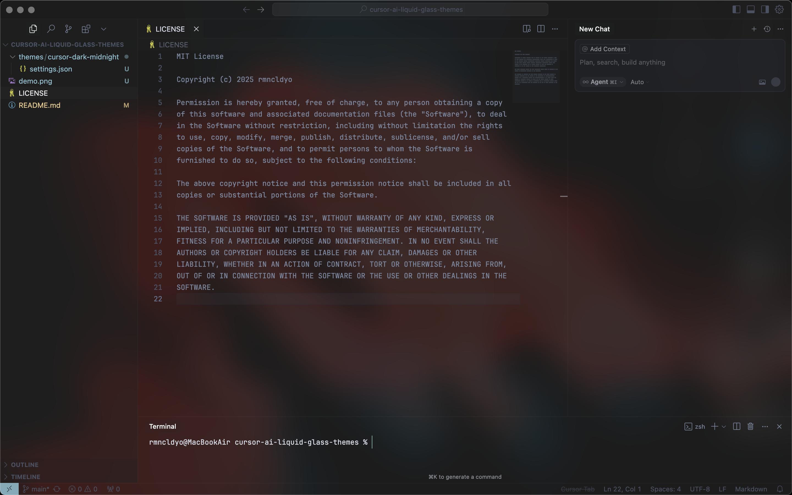

<div align="center">
  <div align="center">
    <a href="https://www.cursor.com/" target="_blank" rel="noopener noreferrer" title="Cursor" aria-label="Cursor" style="text-decoration: none; cursor: pointer;">
      
    </a>
  </div>

  <div align="center" style="margin-bottom: 1.5rem; margin-top: 1.5rem;">
    <p style="font-size: 1rem; font-weight: bold;">A modern, liquid-glass theme modification for Cursor AI.</p>
  </div>

  <div align="center">
    
  </div>

  <div align="center">
    <p style="font-size: 1rem; font-style: italic;">I originally created this mod for my own setup (inspired by <a href="https://x.com/ryolu_/status/1932162324569506157" target="_blank">@ryolu_</a>), but with the Liquid Glass announcement, it felt like the right time to open source it so everyone could enjoy it.</p>
  </div>
</div>

## Table of Contents
- [Features](#features)
- [Installation](#installation)
  - [1. Install the Vibrancy Extension](#1-install-the-vibrancy-extension)
  - [2. Apply the Theme Settings](#2-apply-the-theme-settings)
  - [3. Reload Vibrancy](#3-reload-vibrancy)
  - [4. Restart Cursor](#4-restart-cursor)
- [Platform-Specific Tweaks](#platform-specific-tweaks)
  - [macOS](#macos)
  - [Windows](#windows)
- [Configuration](#configuration)
- [Reference: VS Code Theme Colors](#reference-vs-code-theme-colors)
- [Contributing](#contributing)
- [License](#license)
- [Disclaimer](#disclaimer)

## Features

- **Acrylic/Glass Effect:** Utilizes real vibrancy for an authentic glass look
- **Dark Midnight Palette:** Designed for clarity and visual comfort
- **Minimal, Focused Settings:** No unnecessary configuration
- **Extensible:** Built to support additional themes in the future

## Installation

### 1. Install the Vibrancy Extension

Install [`illixion.vscode-vibrancy-continued`](https://marketplace.visualstudio.com/items?itemName=illixion.vscode-vibrancy-continued`) to enable the glass/acrylic effect in Cursor.

- Open the Extensions sidebar (`Ctrl+Shift+X` or `Cmd+Shift+X`)
- Search for `Vibrancy Continued`
- Install the extension

### 2. Apply the Theme Settings

- Copy the contents of `themes/cursor-dark-midnight/settings.json` into your Cursor `settings.json` (or use settings sync)
- Optionally, symlink the file for easier updates

### 3. Reload Vibrancy

- Press `F1` (or `Cmd+Shift+P`) and run `Reload Vibrancy`
- Restart Cursor if necessary

### 4. Restart Cursor

- Close Cursor completely
- Reopen Cursor to apply the changes

## Platform-Specific Tweaks

### macOS
- Should work out of the box. If you encounter permission errors, try:
  ```sh
  sudo chown -R $(whoami):staff "/Applications/Visual Studio Code.app/"
  sudo chmod -R 755 "/Applications/Visual Studio Code.app/"
  ```
- If you see `EROFS: read-only file system`, move Cursor in and out of `/Applications` or run:
  ```sh
  sudo xattr -dr com.apple.quarantine "/Applications/Visual Studio Code.app"
  ```

### Windows
- Add `--disable-gpu-compositing` to your Cursor shortcut target. Example:
  ```
  "C:\\Users\\User\\AppData\\Local\\Programs\\Cursor\\Cursor.exe" --disable-gpu-compositing
  ```
- In settings, check `Disable frameless window` if you have window interaction issues
- If you see `[Unsupported]` in the title bar, try the [Fix VSCode Checksums](https://marketplace.visualstudio.com/items?itemName=lehni.vscode-fix-checksums) extension

## Configuration

Key settings in `settings.json`:

- `vscode_vibrancy.type`: `acrylic` (Windows) or your preferred vibrancy type (macOS)
- `vscode_vibrancy.opacity`: 0 (max glass) to 1 (no glass); recommended: 0.25
- `vscode_vibrancy.refreshInterval`: Lower is snappier, higher is less CPU; default: 100ms
- Color overrides for the glass look (adjust as needed)

## Reference: VS Code Theme Colors

For a comprehensive list of all color options that can be customized in VS Code (and thus in Cursor), see the official [VS Code Theme Color Reference](https://code.visualstudio.com/api/references/theme-color).

This resource is invaluable for anyone looking to extend or build on top of the current theme settings. It allows you to see every possible color key you can override, making it easier to customize or create new themes based on this repository.

## Troubleshooting

- **Effect not working?**
  - Ensure the extension is installed and enabled
  - Reload Vibrancy (F1 → Reload Vibrancy)
  - Restart Cursor
  - Check your OS transparency settings
- **Terminal rendering issues?**
  - Set `"terminal.integrated.gpuAcceleration": "off"` in your settings
- **Permission errors on macOS?**
  - See the macOS section above
- **Window issues on Windows?**
  - See the Windows section above
- **Still having trouble?**
  - Try reinstalling the extension or Cursor

## Uninstalling

- Press F1 → `Disable Vibrancy`, then restart Cursor
- Or uninstall the extension and restart

## Contributing

The repository is structured for easy addition of new themes. Contributions are welcome:

- Fork the repository
- Add your theme in the `themes/` directory
- Update documentation as needed
- Open a pull request targeting `main`

## Credits

- [illixion.vscode-vibrancy-continued](https://github.com/illixion/vscode-vibrancy-continued) for the vibrancy engine
- [EYHN](https://github.com/EYHN) for the original Vibrancy
- [be5invis/vscode-custom-css](https://github.com/be5invis/vscode-custom-css) for the CSS injection base
- [DIYgod](https://github.com/DIYgod) for fixes

## License

MIT License - see [LICENSE](LICENSE)

## Disclaimer

Use this project at your own risk. I am not responsible for any issues that may arise with your editor after installing the vibrancy extension, editing your settings.json, or making any other changes. Please be aware that the [`illixion.vscode-vibrancy-continued`](https://marketplace.visualstudio.com/items?itemName=illixion.vscode-vibrancy-continued) extension may trigger a popup stating: `Your cursor installation appears to be corrupt. Please reinstall`. This is expected and normal behavior for users of the vibrancy extension, and not caused by this theme or repository.

---

Made with ❤️ by RMNCLDYO.